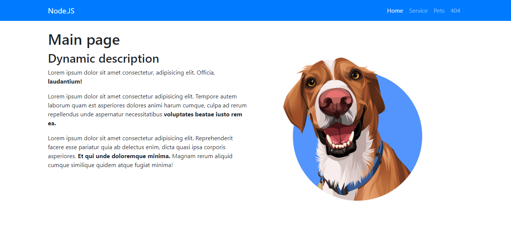
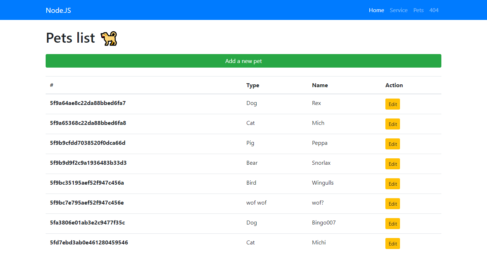
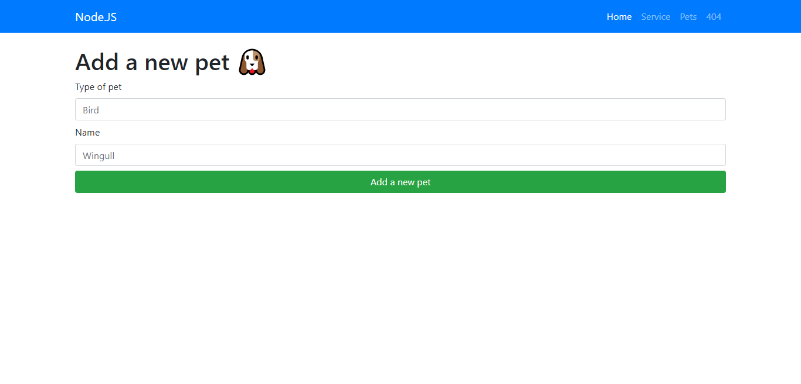
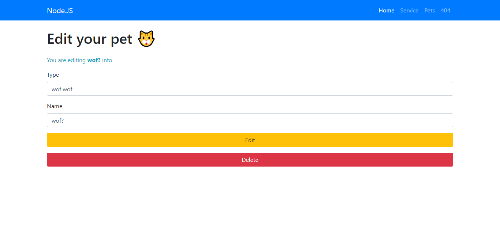
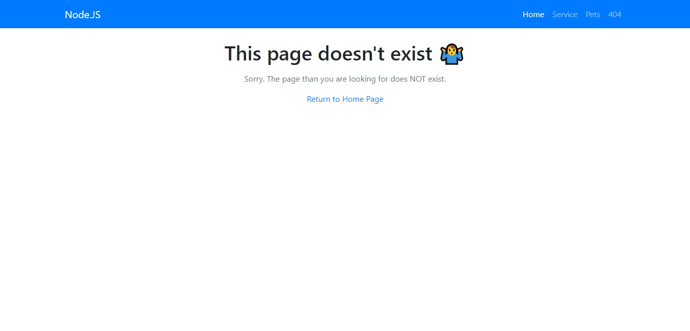

## CRUD created with EJS engine template. Backend built with Node.JS with Express Library. Using MongoDB Atlas for database.

### First look
___
#### First Mode

#### Second Mode

#### Third Mode

#### Fourth Mode

#### Fiveth Mode
